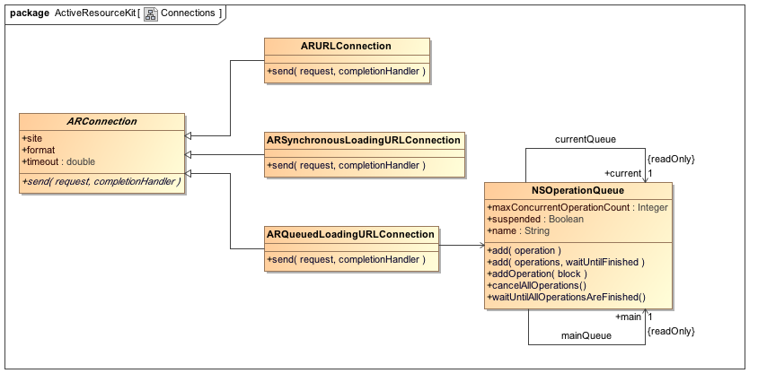

# Active Resource Kit

## Connections

Cocoa's Foundation framework supports three distinct URL connections. Active Resource Kit models them using four object classes: one abstract with three corresponding concrete implementation classes.

## Testing

Run tests by selecting either the ActiveResourceKitFramework or
ActiveResourceKitLibrary targets. Selecting Run » Tests (Cmd+U shortcut)
launches the tests.

In the background, the schemes run a Thin server. This assumes that you do not
already have a Thin server up and running for the Rails test application. If you
do have a server already running in the background, the tests terminate the
current background instance in order to set up and prime the fixtures, before
launching a new server instance. This happens quite quickly; Thin is a
fast-loading web server.

### Viewing the Test Server Log

You can view the test servers log using the command:

	➜  active-resource-kit-tests git:(master) tail -f log/thin.log

## Design Notes

### Resource Associations

When resources load at the client side, what binds their associations? How can
the client resolve foreign keys? To do so, the client needs to identify the
active resources.

Using the principle of convention over configuration, `ARBase` registers its
instances by default, and each `ARBase` retains its `AResource`s. Hence it can
resolve the association whenever a new resource appears with an ID matching some
existing foreign key. Similarly when a new record comprising an unresolved
foreign key loads, `ARBase` can resolve it against an existing resource.

### Incremental Stores

Apple provide a useful Core Data component called `NSIncrementalStore`, designed
for interacting with external stores which do not bring all data into memory the
way atomic stores do. Data loads and stores incrementally. Incremental stores
let you plug RESTful resources into a standard Core Data stack.

One important drawback exists however. Incremental stores, at the current
version, do not accommodate _asynchronous_ network communication. Core Data
sends execute-request messages to the store, expecting the store to respond with
results immediately on return. You can respond with faults but doing so requires
you to know object identities for faulting. Problem is, you cannot execute a
fetch request with faulting object identities without some server interaction.
Unless the code blocks for synchronous communication, you cannot return with
anything else except an error.

### Rails Kit Sub-Framework

Active Resource Kit is designed as a sub-framework on Mac OS X, though not so in
iOS. Framework requirements mandate the following build setting within the Rails
Kit sub-frameworks.

	DYLIB_INSTALL_NAME_BASE = "@executable_path/../Frameworks/RailsKit.framework/Versions/Current/Frameworks"

It tells an application to look for the sub-framework at the given location
relative to the application binary within the application bundle. This makes an
assumption: that you locate the RailsKit.framework within the bundle. The
sub-frameworks exist as sub-sub-frameworks within the application bundle. Hence
the install-name base path specifies the `RailsKit.framework`'s `Frameworks`
sub-folder.

